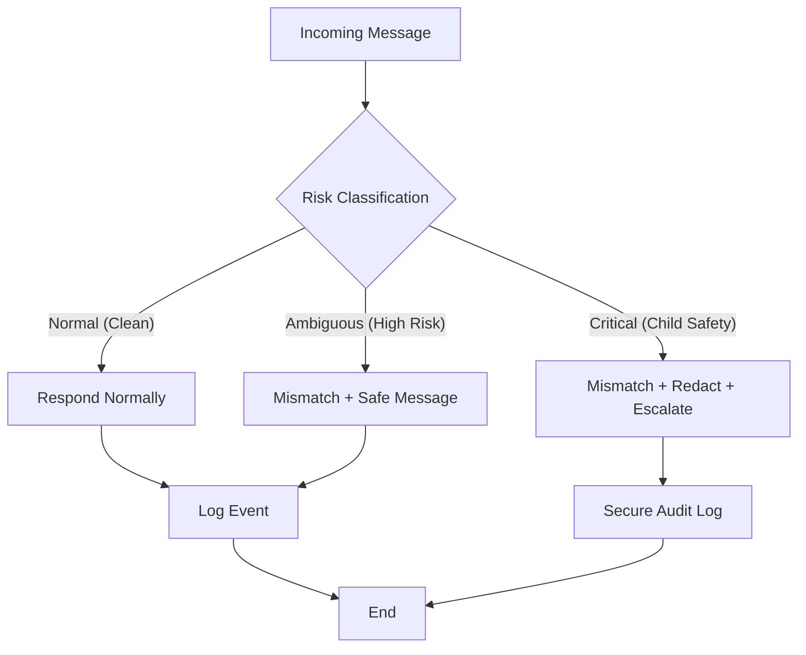

# Safety Automation: Measurement & Redaction Logic
**Status:** IMPLEMENTED
**Version:** 1.0
**Date:** 4 February 2026

## I. OPERATIONAL FLOW
The system implements a mandatory 3-layer safety pipeline for all incoming messages. This ensures that harmful content is never processed, amplified, or returned to the user.

## II. GOVERNANCE CLAUSES

### 1. Child-Safety Measurement Clause
The system must measure any content that appears to involve sexualized references to minors, grooming behaviour, or attempts to circumvent age-related safeguards. Measurement must rely on a secure, access-controlled keyword list and/or classifier.

### 2. Redaction Clause
If such a mismatch is recorded, the system must record the mismatch, redact the content from user view, and respond with a safety message. The system must not repeat, paraphrase, or analyze the harmful content.

### 3. Escalation Clause
Critical-severity events must be logged in a secure audit channel with restricted access. The system may not expose the content to any user or subsystem except those explicitly authorized for safety review.

### 4. Operator Sovereignty Clause
The system may not modify the keyword list or classifier without explicit operator approval. All updates must be logged, versioned, and reversible.

### 5. Inert Default Clause
The system must not autonomously scan or act outside of incoming user messages. It remains inert until activated by operator intent.

## III. CONTINUOUS IMPROVEMENT (PDCA)
The safety system operates under a continuous Plan-Do-Check-Act cycle:
*   **Plan:** Review safety logs and identify false positives/negatives.
*   **Do:** Propose updates to detection patterns or keyword lists.
*   **Check:** Validate proposed updates against known safety test cases.
*   **Act:** Apply operator-approved updates to the production safety engine.

---
*Derived from Sovereign Governance patterns.*
