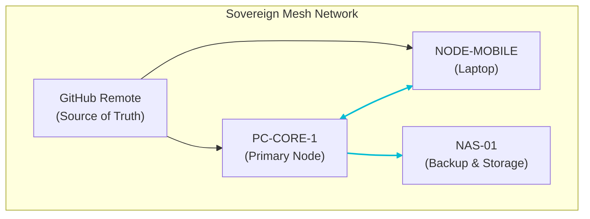

# Sovereign Infrastructure Architecture: A Unified Topology

**Document ID:** SIA-20260202-v1.0
**Author:** Manus AI
**Status:** Final Draft
**Date:** 2026-02-02

---

## 1. Executive Summary

This document presents a synthesized, unified view of the Sovereign Infrastructure ecosystem. Based on reconnaissance across integrated systems—including GitHub repositories, Google Drive artifacts, Slack channels, and direct user directives—this architecture map defines the system's current state, governance framework, and operational doctrines. The core of the system is a **resilient, multi-homed mesh network** designed for both online and air-gapped operations, governed by a strict, machine-enforced constitution that prioritizes **immutable audit trails, human oversight, and deterministic behavior**.

The infrastructure is a hybrid of remotely accessible nodes connected via a Tailscale mesh and a physically isolated, air-gapped LAN for high-security operations. Containerized services, orchestrated via Docker Compose and designed for a future transition to Kubernetes, provide a flexible and scalable service layer. A key component is the multi-homing laptop (`NODE-MOBILE`), which acts as a versatile control and development node, capable of connecting remotely, via hardwired LAN, or through trusted WiFi.

This document codifies the discovered topology, formalizes the user's operational doctrines (such as the "Starry Night Protocol"), and provides a concrete integration scaffold for the multi-homing laptop, ensuring it operates within the established governance boundaries.

---

## 2. Core Doctrine & Governance Framework

The entire infrastructure operates under a strict, constitutionally-defined governance model that is both machine-readable and legally robust. Its principles are designed to ensure operational sovereignty, security, and resilience.

### 2.1 Constitutional Principles

The system's foundation is defined by five core principles, as specified in `Governance/governance_config.yaml` [1]. These principles are immutable and enforced by the system's CI/CD pipeline and runtime monitors.

| Principle ID | Name | Description |
|--------------|------|-------------|
| **CP-001** | Immutable Audit Trail | All significant actions must be logged to a ledger with hash chain integrity. |
| **CP-002** | Human Oversight | High-risk decisions require explicit, cryptographically-sealed human approval. |
| **CP-003** | Constitutional Supremacy | No agent, user, or process may override the foundational constitution. |
| **CP-004** | Deterministic Behavior | Given the same inputs, a process must produce the same outputs, ensuring predictability. |
| **CP-005** | Graceful Degradation | The system must fail safely and overtly, never silently, to prevent unforeseen states. |

### 2.2 Autonomy Model: Human-Sealed Actuation

The system employs a sophisticated autonomy model defined in `AUTONOMY_LIMITS.md` [2], which operates under the principle of **"Autonomous Cognition, Human-Sealed Actuation."** This allows AI agents to perform analysis, generate proposals, and assess risk autonomously, but strictly prohibits them from taking external action without a human's cryptographic signature.

- **Allowed Actions (Autonomous):** Analysis, risk assessment, reporting, and triage. All outputs are written to a `PROPOSED` state for review.
- **Forbidden Actions (Require Seal):** Financial transactions, legal agreements, system modifications, and all external communications (emails, API calls, webhooks).

This model ensures that the system can leverage AI for complex decision support while retaining absolute human control over all consequential actions, aligning with the highest standards of safety and governance, such as ISO/IEC 42001 and the NIST AI Risk Management Framework.

### 2.3 Governance Bodies & Roles

The system defines clear roles and responsibilities, ensuring a separation of concerns and robust oversight.

| Role | Responsibilities | Key Artifacts |
|------|------------------|---------------|
| **System Architect** | Defines and maintains the constitutional framework and overall system design. | `governance_config.yaml` |
| **Governance Board** | Reviews and approves constitutional amendments and phase promotions. | `AUTONOMY_LIMITS.md` |
| **Ops Lead (John Parker)** | Manages day-to-day operations, deployment, and infrastructure health. | `onboarding_new_laptop.md` |
| **Commercial Lead (Gordon Stein)** | Manages user-space activities related to commercial and capital matters. | `sovereign-kernel-deployment-status.md` |

---

## 3. Infrastructure Topology

The infrastructure is composed of two primary environments: a **remote-access mesh** for distributed, flexible operations and an **air-gapped LAN** for secure, isolated workloads.

### 3.1 Remote Access Mesh Topology

The primary operational environment is a mesh network built on Tailscale, providing secure, zero-configuration connectivity between nodes. The GitHub repository serves as the ultimate source of truth for all code and configuration.


*Diagram based on `docs/NODE_INVENTORY.md` [3]*

### 3.2 Air-Gapped LAN Topology

For high-security tasks, a dedicated, physically isolated LAN is used. This network has no connection to the outside internet, ensuring complete data and operational sovereignty.

```mermaid
graph TD
    subgraph Air-Gapped LAN (192.168.50.0/24)
        Node01["NODE-01: ORCHESTRATOR<br>192.168.50.10<br>Services: Boardroom, Golden Master"]
        Node02["NODE-02: TRUTH-ENGINE<br>192.168.50.20<br>Services: txtai, Ollama, FastAPI"]
        Node03["NODE-03: AGENT FLEET<br>192.168.50.30<br>Services: Executor, Evidence, Property"]
        SharedCorpus["Shared Corpus<br>(Read-Only SMB/NFS)"]
    end

    Node01 <--> Node02
    Node02 <--> Node03
    Node01 --> SharedCorpus
    Node02 --> SharedCorpus
    Node03 --> SharedCorpus
```
*Diagram based on `deploy/LAN_DEPLOYMENT_TOPOLOGY.md` [4]*

### 3.3 Containerized Services

The system's functionalities are delivered via a suite of containerized services managed through `docker-compose.yml` [5]. This modular architecture allows for independent development, scaling, and deployment of each component.

| Service | Role | Ports | Key Dependencies |
|---|---|---|---|
| **truth-engine** | Provides RAG, search, and embedding capabilities. | `5050` | `ollama` |
| **ollama** | Serves large language models for inference. | `11434` | - |
| **boardroom** | The central UI and governance dashboard. | - | - |
| **executor** | A general-purpose agent runner. | - | `truth-engine` |
| **evidence** | An agent specialized in validating evidence chain integrity. | - | - |
| **property** | An agent for analyzing and validating property-related artifacts. | - | `truth-engine` |
| **blade-watcher** | Monitors the file system for changes and triggers events. | - | `truth-engine` |

---

## 4. Access Control & Security

Security is enforced through a multi-layered approach, combining network-level access control, strict role-based permissions, and a robust backup strategy.

### 4.1 Multi-Homing Laptop Integration

The laptop (`NODE-MOBILE`) is a critical node with three distinct connectivity modes. The system must automatically detect and adapt its policies based on the current mode.

| Mode | Context | Network Path | Primary Use Case |
|---|---|---|---|
| **Remote** | Off-site, mobile | WAN via Tailscale SSH | Development, monitoring, remote command execution. |
| **Hardwired** | At secure base | Direct Ethernet to internal LAN | High-bandwidth data transfer, direct access to air-gapped systems. |
| **Local WiFi** | At secure base | WiFi on trusted LAN segment | Convenient on-site access with trusted network policies. |

### 4.2 Access Control Policy

Access to nodes is governed by a tiered policy, explicitly defined by the user, which balances security with operational flexibility.

| Class | Node Type | Allowed Access Methods | Rationale |
|---|---|---|---|
| **Class A** | Core Sovereign Nodes (e.g., K8s masters, evidence stores) | **Tailscale SSH only** | Maximum security, minimal attack surface. No GUI access permitted. |
| **Class B** | Ops Desktops & GUI Helper Nodes | Tailscale SSH + **Optional Chrome Remote Desktop** | Provides GUI access for specific tools while maintaining a secure baseline. |
| **Class C** | Child / Shared / High-Risk Devices | **No remote tools** (except supervised screen sharing) | Protects vulnerable users and devices by prohibiting persistent remote access. |

### 4.3 Backup and Recovery

The system's resilience is ensured by a multi-tiered backup strategy, with critical data synced to a Network Attached Storage (`NAS-01`) and archived to external media.

- **Daily:** Critical configuration (`docs/`, `scripts/`, `.github/`) is synced to `NAS-01`.
- **Weekly:** A full snapshot of the `sovereign-system` repository is taken.
- **Monthly:** A full, GPG-encrypted archive is created and stored on an external drive.

Recovery procedures are documented in `docs/NODE_INVENTORY.md`, allowing for the complete reconstruction of a node from the GitHub repository and backups.

---

## 5. Operational Protocols & Doctrines

Several user-defined doctrines govern the system's dynamic behavior.

- **Starry Night Protocol:** A survival strategy where nodes are geographically and logically dispersed. If a node goes offline, the constellation remains operational, and the lost node can re-converge upon its return. This ensures no single point of failure.

- **Mycelial Auto-Connect:** A behavior for the multi-homing laptop where it automatically detects and joins trusted WiFi networks when at a secure base, seamlessly transitioning from a remote to a local operational context.

- **Disperse:** A core tenet of the survival strategy, emphasizing distributed redundancy of data, services, and authority to withstand catastrophic failures.

---

## 6. Integration Scaffold for Multi-Homing Laptop

To formally integrate the laptop (`NODE-MOBILE`) into this architecture, the following steps should be taken:

1.  **Create an Access Policy File:** Create a file named `ACCESS_POLICY.md` in the root of the `sovereign-system` repository to codify the Class A/B/C access rules.

2.  **Implement Mode Detection Script:** Develop a script on the laptop that:
    *   Detects the current network state (Tailscale-only, specific LAN subnet, specific WiFi SSID).
    *   Applies the corresponding firewall rules and access policies based on the detected mode.
    *   Logs all mode transitions to a local, immutable log file.

3.  **Configure Chrome Remote Desktop:** For nodes designated as **Class B**, follow the official instructions to install and configure Chrome Remote Desktop, ensuring it is tied to a secure, 2FA-protected Google account.

4.  **Update Node Inventory:** Update `docs/NODE_INVENTORY.md` to explicitly classify each known node (PC-CORE-1, NODE-MOBILE, etc.) into Class A, B, or C.

---

## 7. References

[1] `sovereign-system/Governance/governance_config.yaml`
[2] `sovereign-system/AUTONOMY_LIMITS.md`
[3] `sovereign-system/docs/NODE_INVENTORY.md`
[4] `sovereign-system/deploy/LAN_DEPLOYMENT_TOPOLOGY.md`
[5] `sovereign-system/docker-compose.yml`
